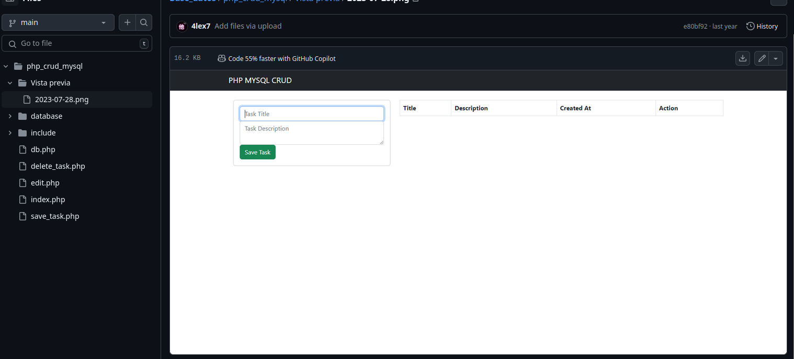
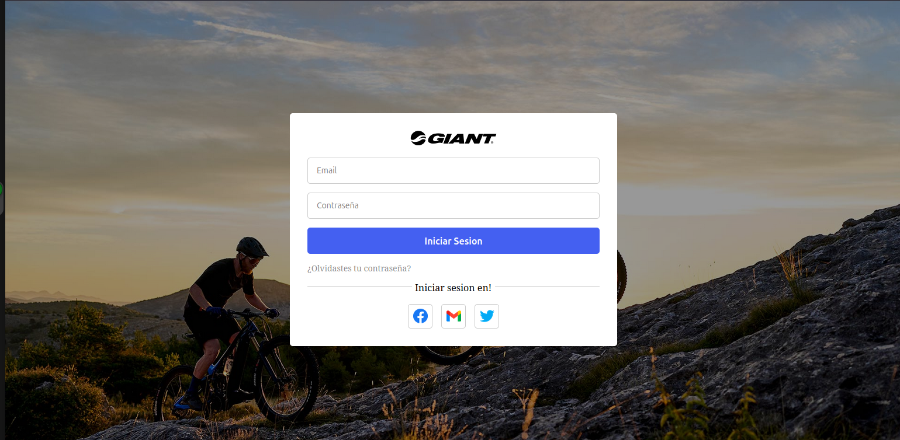
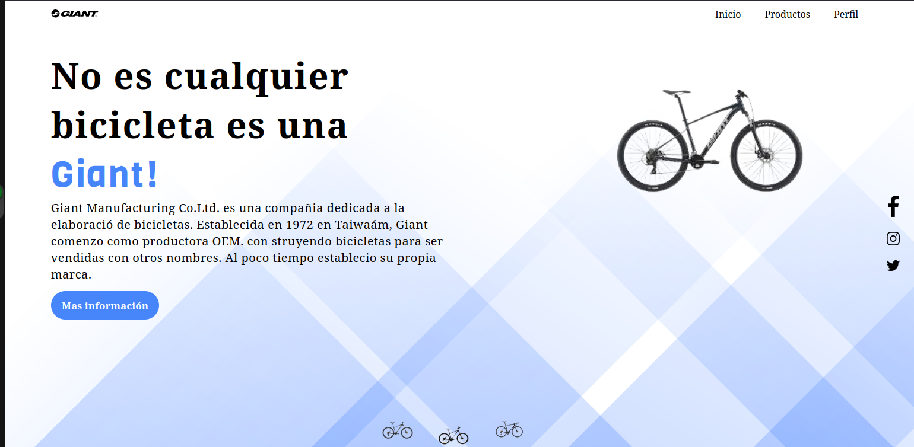

Hola! , en esta linea de tiempo las separare por 3 secciones:

- Teléfonos
- Ordenadores
- Sistemas operativos
- Lenguajes informáticos
- Proyectos
- Actualidad

## Lista de temas

1. [Mis teléfonos (2014 - 2024)](#mis-teléfonos-2014---2024)
2. [Mis Ordenadores (2017 - 2023)](#mis-ordenadores-2017---2023)
3. [Lenguajes informáticos](#lenguajes-informáticos)
4. [Proyectos y mis primeros códigos](#proyectos-y-mis-primeros-codigos)
5. [Actualidad](#actualidad)

## Mis teléfonos (2014 - 2024)

### `Alcatel One touch` (2014 - 2017)

Mi primer teléfono fue un `Alcatel One Touch` el cual aunque era bastante lento me ayuda como cosas básicas como ver vídeos de `youtubue` y hablar con mi madre.

El cual fue un teléfono que me duro hasta el **2017** por que un día termino de fallar y ya nunca volvió a encender.

### `Sansumg Galaxy` (2017 -2023)

Luego me compraron un teléfono bastante decente no era la gran maravilla. Pero era lo suficientemente potente para jugar algunos juegos y ver vídeos de una mayor calidad sin que se trabara.

Luego un chico ahí de mi colegio me termino `destrosando` todo mi teléfono ahí por la fecha de **junio/2023** y pues bueno me quede sin teléfono 2 meses.

## `Sansumg S20` plus (2023-2024)

Después de quedarme sin teléfono mi madre decidió regalarme el suyo y pues bueno al final es el que tengo hasta la fecha bastante potente y es el que me sirve para hacer bastante tareas simultaneas y proteger y administrar de una mejor forma mis credenciales.

## Mis Ordenadores (2017 - 2023)

## `Ciber` de mi pueblo (2017 - 2018 )

La verdad es que yo nunca e tenido una `pc` o un computador personal común mente mi primer contacto con un ordenador fue en un `ciber` ya que tenia que hacer tareas para mi escuela.

Yo por mi cuenta tuve que aprender cada día a día por medio de `tutoriales` de `youtube` como utilizar una computadora o como utilizar el `google chrome `en esa época no tenia mucha experiencia en ese tiempo pero amenos ya sabia lo básico para almacenar archivos en una `USB` o en como funciona `google Drive y Chrome` la verdad como yo vivía en un pueblo y las computadoras eran bastante viejas mi primer Sistema operativo o mejor dicho mi primer `Kernel` fue **`Linux`** con su distribución **`Ubuntu`** Aunque suene loco yo comencé con `Linux` aunque no sabia utilizar la terminal y solo utilizaba la parte de Interfaz de usuario es una dato interesante.

## `Ciber` de ciudad (2018-2020)

Cuando tuve la edad y la responsabilidad suficiente para que mi madre me dejara ir a la ciudad yo mismo descubrí un `ciber` bastante mejor que el de mi pueblo y pues como tenia que sacar unas impresiones al utilizar la computadora me sorprendí bastante cuando descubrí que existía otro sistema operativo y ese era **`Windows`** la verdad me sentí bastante raro utilizar el `windows` 10 pero bueno al final era casi lo mismo que la interfaz de `linux` `ubuntu` así que no me costo mucho.

## Elección de mi bachiller (2022)

Pues bueno como ven no eh tenido muy buena experiencia con la tecnología e informática por falta de recursos, al final de cuentas yo quería ser cirujano pero me enviaron a un colegio donde no había... **Bachiller de salud** la verdad me daba decepción porque tenia que elegir entre 3 carreras:

- Bachiller Software.
- Bachiller Idiomas.
- Bachiller General.
  Adivina con cual me quede?... Pues bueno en mi mente pensaba que iba estar sentado en una computadora no se jugando o haciendo nada y esperar a la universidad para agarrar la carrera de medicina y ser un buen cirujano. Mis notas eran... una decepción. Para darte un ejemplo reprobé **9 MATERIAS** de mi bachiller y 5 de ellas eran. Las otras 4 es por que no les eche gana la verdad.
- tecnología.
- programación 1.
- informática 1.
- matemáticas.
- física.
  Pero bueno esas 5 materias las lleve con con nota **2 a 1** la verdad es que no me importaba para nada la informática y yo odiaba programar asta que...

## Ordenadores de colegio (2022 - 2023)

Un día decidí darle la oportunidad a este mundo de la programación e informática por que la verdad no quería decepcionar a mi madre con mis notas... Pues bueno un día llegue bastante temprano al colegio pedí permiso de utilizar las computadoras y pues bueno. me comencé haber un `tutorial` de como programar desde cero y pues bueno al final me di cuenta el verdadero arte de programar.

Y cada día a la misma hora siempre iba a estudiar por mi cuento por que vuelvo y repito nunca tuve mi ordenador propio y todas las bases que yo se lo aprendí en ordenadores ajenos.

Así que cuando vi el verdadero potencial de los lenguajes de programación e informática dije joder este profesor los explica BIEN, PERO BIEN DE LA `VERG`... Pero bueno era muchísimo mejor estudiar por mi cuenta que ir a las clases.

Y pues ahí me enamore de la programación y aprendí mucho mas de como manejar los sistemas operativos tanto **`Linux`** y **`Windows`** ya que en la sala de computación habían computadores de ambos `Kernels`.

## Mi primer computador personal (2023 -2024)

Cuando mi madre vio que me gustaba mucho la tecnologia digamos que en **septiembre/2023** me compro mi primer **laptop** que tenia **windows 11** y es la que uso hasta ahorita para aprender y es la que me a acompañado en proyectos personales y estudios.

## Lenguajes informáticos

### `Pseudo Codigo` (2022 -2023)

#### `Pseint` (2022 -2023)

Mi primer lenguaje en el mundo de la informática fue un `Pseudocodgio` llamado `Pseint` el cual me ayudo con las bases de la programación y es con el que yo comencé a programar en las computadoras de mi colegio.

#### Pseudocode (2022 - 2023)

Este tambien fue otro psudocodigo yaque es el que yo programaba en mi telefono ya que no teniar ordenador a si que si persona que vea esto yo aprendi a programar en telefono.

### Lenguajes de programación 2022 - 2023

#### `Python` (2022- 2023)

Mi primer lenguaje de programación fue `python` era bastante amigable y era casi lo mismo que utilizar un `pseudo` código así que solo basto con un `tutorial` de 8 horas para aprender sintaxis y lógica junto un poco a `virtual enviroments`.

#### `JavaScript` (2022-2023)

También mi segundo lenguaje fue `JavaScript` que es el lenguaje que en mi opinión fue mi favorito ya que `python` aunque fuera fácil me quedaba muy escaso de creatividad. pero `JavaScript` me permitía hacer lo mismo pero trabajando en la parte web y ahí es donde descubrí mi pasión con el desarrollo web.

#### `PHP (2023-2024)`

Cuando llevara mi segundo bachiller de descubrí `php` por que era el que trabajábamos con `programación II `y pues bueno yo odio el lenguaje nunca me gusto bastante complicado. Pero lo único que yo ame es el MARAVILLOSO Y PODEROSO: **`php my admin`**... UF, para las bases de datos con `MySQL` me enamore pero bueno al final lo deje por que bastante viejo el lenguaje y quería algo nuevo.

#### `C++` (2023-2024)

Yo aprendí `C++` por mi cuenta solo hasta programación orientada a objetos para trabajar en mi proyecto de tecnología con placas de `Arduino` pero al final es un lenguaje que me gusto mas o menos.

#### Otros lenguajes Lenguajes de programación (2024)

Estos lenguajes son los únicos que no aplique en proyectos por lo cual solo conozco las bases y nunca les e dado utilidad que solamente nada mas para aprender y explorar nuevos campos.

- `Ensamblador`
- `Bat`
- `C#`
- `C`
- `Lua`
- `Microsoft .NET`
- `Java`

### Lenguajes de desarrollo (2023-2024)

#### `HTML y CSS`

Yo al ver el potencial de `javaScript` me puse a ver `tutoriales` y pues bueno al final me di cuenta de `HTML` y `CSS` que al final me enamore de ellos por que fue a comensal el desarrollo web no como un trabajo si no como un arte visual para los usuarios y pues bueno aquí estoy siendo el `frontend` y `sysadmin` del equipo de presencia web.

## Proyectos y mis primeros codigos

### Mis primeros `Hello, World!` (2020 - 2023)

Mi primer `Hello, world!` fue en `PSeint` y acá te dejo el primer código que hice en toda mi historia como `desarrollador`:

```Pseint
Escribir "Hello, World!"
```

Es una hermosura verdad?

### Mi Calculadora (`JavaScript`-2020)

Cuando aprendí `JS` pude hacer una calculadora que podía hacer todas las operaciones básicas con un `prompt` y `alerts` con menú incluido.

```JavaScript
let continuar = true;

while (continuar) {
    let num1 = parseFloat(prompt("Introduce el primer número:"));
    let num2 = parseFloat(prompt("Introduce el segundo número:"));

    let operacion = prompt("¿Qué operación deseas realizar? (sumar, restar, multiplicar, dividir):").toLowerCase();

    let resultado;

    switch (operacion) {
        case "sumar":
            resultado = num1 + num2;
            alert("El resultado de la suma es: " + resultado);
            break;
        case "restar":
            resultado = num1 - num2;
            alert("El resultado de la resta es: " + resultado);
            break;
        case "multiplicar":
            resultado = num1 * num2;
            alert("El resultado de la multiplicación es: " + resultado);
            break;
        case "dividir":
            if (num2 === 0) {
                alert("No se puede dividir por cero.");
            } else {
                resultado = num1 / num2;
                alert("El resultado de la división es: " + resultado);
            }
            break;
        default:
            alert("Operación no válida. Por favor, elige entre sumar, restar, multiplicar o dividir.");
    }

    let respuesta = prompt("¿Deseas realizar otra operación? (sí/no):").toLowerCase();

    if (respuesta !== "sí") {
        continuar = false;
    }
}

alert("Hasta luego XD.");

```

### Snake(Python-2021)

Este juego de serpiente come manzanas lo hice desde cero para ver que hubiera pasado si yo hubiera querido meterme al campo de video juegos.

```python
import turtle
import time
import random

posponer=0.1;
#Marcador
score=0;
high_score=0;

#windows
wn=turtle.Screen();
wn.title("Juego de pong");
wn.bgcolor("black");
wn.setup(width=600, height=600);
wn.tracer(0);

#Head Snake
cabeza=turtle.Turtle();
cabeza.speed(0);
cabeza.shape("square");
cabeza.penup();
cabeza.goto(0,0);
cabeza.direction="stop";
cabeza.color("white")

#food
comida=turtle.Turtle();
comida.speed(0);
comida.shape("circle");
comida.color("red");
comida.penup();
comida.goto(0,100);

#body
segmentos=[]

#Text
texto=turtle.Turtle();
texto.speed(0);
texto.color("white")
texto.penup();
texto.hideturtle();
texto.goto(0,269)
texto.write("Score: 0    HighScore: 0", align="center", font=("Courier",24,"normal"));


#Funtion
def arriba():
    cabeza.direction="up";
def abajo():
    cabeza.direction="down";
def izquierda():
    cabeza.direction="left";
def derecha():
    cabeza.direction="right";

def mov():
    if cabeza.direction=="up":
        y=cabeza.ycor();
        cabeza.sety(y +20);

    if cabeza.direction=="down":
        y=cabeza.ycor();
        cabeza.sety(y -20);


    if cabeza.direction=="left":
        x=cabeza.xcor();
        cabeza.setx(x -20);

    if cabeza.direction=="right":
        x=cabeza.xcor();
        cabeza.setx(x +20);


    if cabeza.direction=="up":
        y=cabeza.ycor();
        cabeza.sety(y+20);


#Teclado
wn.listen()
wn.onkeypress(arriba,"Up");
wn.onkeypress(abajo,"Down");
wn.onkeypress(izquierda,"Left");
wn.onkeypress(derecha,"Right");
while True:

    wn.update()
      #colicion
    if cabeza.xcor()>280 or cabeza.xcor()< -280 or cabeza.ycor()> 280 or cabeza.ycor()< -280:
        time.sleep(1);
        cabeza.goto(0,0);
        cabeza.direction="stop";

        #esconder
        for  segmento in  segmentos:
            segmento.goto(1000,1000)

        #Resetear marcador
        score=0;
        texto.clear();
        texto.write("Score: {} HighScore: {}".format(score,high_score),
                    align="center", font=("Courier",24,"normal"));
    #Clear
        segmentos.clear();


    #Food colicion
    if cabeza.distance(comida)<20:
        x= random.randint(-280,280);
        y= random.randint(-280,280);
        comida.goto(x,y);

        nuevo_segmento=turtle.Turtle();
        nuevo_segmento.speed(0);
        nuevo_segmento.shape("square");
        nuevo_segmento.penup();
        nuevo_segmento.color("grey");
        segmentos.append(nuevo_segmento)
        #Aumentar Marcador
        score+=1;
        if score>high_score:
            high_score=score;
        texto.clear();
        texto.write("Score: {} HighScore: {}".format(score,high_score),
                    align="center", font=("Courier",24,"normal"));

    #move
    totalSeg=len(segmentos);
    for index in range(totalSeg -1,0,-1):
        x= segmentos[index-1].xcor();
        y=segmentos [index-1].ycor();
        segmentos[index].goto(x,y);
    if totalSeg>0:
        x=cabeza.xcor();
        y=cabeza.ycor();
        segmentos[0].goto(x,y)

    mov()
    #Colicion con el cuerpo
    for segmento in segmentos:
        if segmento.distance(cabeza)<20:
            time.sleep(1);
            cabeza.goto(0,0);
            cabeza.direction="stop";

            #Esconder segmentos
            for segmento in segmentos:
                segmento.goto(1000,1000);
            #Limpiar segmentos
            segmentos.clear();
            #Rastrear marcador
            score=0;
            texto.clear();
            texto.write("Score: {}   HighScore: {}".format(score,high_score),
                        align="center", font=("Courier",24,"normal"));
    time.sleep(posponer);
```

### `To do List `(`PHP`-2023)

Esta la hice yo con mis conocimientos de `PHP` y `MySQL` aquí te dejo una foto de ello:


## Pagina web (`HTML`-`CSS`-2023)

Esta pagina web la hice con `CSS` y `HTML` `Vanilla` fue la primera que hice y la que me siento orgulloso.




## Actualidad

Hoy en la actualidad estoy comenzando a nivel laboral a trabajar con estoy hermosos lenguajes y aunque aun me falta mucho por aprender mi hambre de conocimiento y seguir adelanto por mi madre son grandes para seguir adelante!
